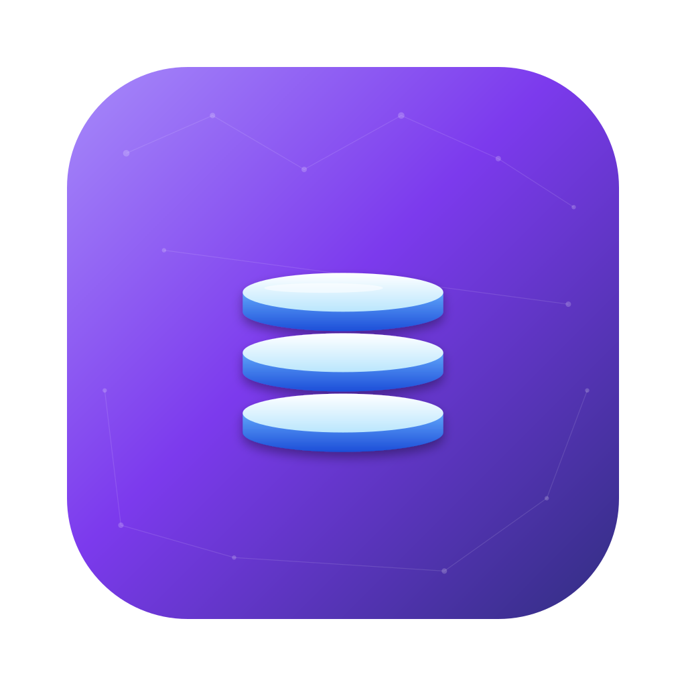

<div align="center">
  

  <h1>NovexDB</h1>

  <p><strong>A modern database client. Fast queries. AI that actually understands them.</strong></p>

  <p>
    Native desktop client for <strong>PostgreSQL</strong>, <strong>MySQL</strong>,
    <strong>SQLite</strong>, and <strong>SQL Server</strong>. Browse and edit
    tables inline, write SQL with autocomplete, and audit your whole database
    with one click — AI that explains every finding in plain English.
  </p>

  <p>
    <a href="#download"></a>
    <a href="#license"></a>
    <a href="#tech-stack"></a>
    
  </p>
</div>

---

## Why NovexDB?

Most SQL clients fall into one of two buckets: **fast but ugly** (DBeaver, pgAdmin) or **beautiful but expensive** (TablePlus, DataGrip). NovexDB aims for the third option — beautiful, fast, *and* free forever — and goes further by giving every connection a built-in AI auditor that can read your schema, find data-quality issues, explain query errors, and write SQL from plain English.

**Two things make NovexDB different:**

1. **AI built in, bring your own key.** Plug in your Anthropic or OpenAI API key once. Every feature — NL→SQL, query explain, optimization, error rescue, full-database audit — runs through *your* key. No middleman, no rate limits we control, no data sent to a NovexDB server (we don't have one).

2. **It runs everything locally.** Every connection is a direct socket from your machine to your database. The only outbound network traffic is to whichever LLM provider you configure. No telemetry, no analytics, no "phone home."

## Features

<table>
<tr>
<td width="50%">

### 🗄️ Database client
- **Multi-engine**: Postgres, MySQL, SQLite, SQL Server
- **Schema explorer** with right-click actions everywhere
- **Editable data grid** — inline edit, multi-row delete, undo
- **SQL editor** with Monaco, schema-aware autocomplete, and one-key formatting
- **Streaming dump imports** — gigabyte `.sql` files in one click
- **Drag-and-drop tabs**, persisted workspaces per connection

</td>
<td width="50%">

### 🤖 AI built in
- **Bring-your-own-key** for Claude (Sonnet 4.6 / Opus 4.7 / Haiku 4.5) or OpenAI (GPT-5 / mini / nano)
- **Natural language → SQL** with full schema context
- **One-click Explain, Optimize, Error-rescue** on any query
- **Database-wide AI audit** — schema, performance, data quality, transactions, security
- **Streaming chat** with the AI about your database
- **Prompt caching** so re-runs cost ~10× less

</td>
</tr>
<tr>
<td width="50%">

### 🛡️ Safety
- **Type-`DELETE`-to-confirm** before destructive operations
- **Transactional cell edits** — every change in a pending transaction until you commit
- **SQL safety analyzer** flags missing `WHERE` on `DELETE`/`UPDATE`
- **Encrypted credential store** — connections + API keys live in the OS keychain

</td>
<td width="50%">

### 🎨 Modern UI
- Native title bar on macOS, custom on Win/Linux
- **Dark + light themes** with semantic tokens
- **Framer Motion** transitions, **TanStack Virtual** rows
- **Auto-updates** via electron-updater
- **Zero telemetry** — what stays on your machine, stays on your machine

</td>
</tr>
</table>

---

## Download

> ⚠️ **Early access.** v0.1 is rough around some edges. File issues if you find them.

Grab the latest installer for your platform from the [Releases page](https://github.com/novexdb/novexdb/releases):

| Platform | File |
|---|---|
| macOS (Apple Silicon) | `NovexDB-x.y.z-arm64.dmg` |
| macOS (Intel) | `NovexDB-x.y.z-x64.dmg` |
| Windows | `NovexDB-x.y.z-setup.exe` |
| Linux | `NovexDB-x.y.z.AppImage` or `.deb` |

Once installed, the app will silently check for updates on a schedule you control in *Settings → Updates*.

---

## Quick start

1. **Download + install** the app for your OS.
2. **Add a connection**: click **+** in the connections rail → fill in host, database, user, password → **Test**.
3. **Pick an AI provider** (optional but recommended): **Settings → AI** → choose Anthropic Claude or OpenAI GPT → paste your API key → **Test connection**.
4. **Open the AI dashboard** with the ✨ button in the explorer toolbar to run a full audit.

That's it. The connection is yours, the key is yours, the data never leaves your machine except for whatever you send to the LLM.

---

## Building from source

### Prerequisites

- **Node.js** 20 or 22 (we test against 22 LTS)
- **npm** 10+
- macOS, Windows, or Linux

### Setup

```bash
git clone https://github.com/novexdb/novexdb.git
cd novexdb
npm install
```

The `postinstall` hook patches the local Electron bundle so the dev app shows the right name + icon in the macOS Dock. Safe to re-run.

### Run in dev mode

```bash
npm run dev
```

Electron-vite spins up the renderer at `http://localhost:5189` and launches Electron pointing at it. Hot-reload works for the renderer; main-process changes need a `Cmd+R` (or restart the dev server).

### Run the tests

```bash
npm run typecheck    # tsc in both main + renderer
npm run lint         # ESLint
npm run test:run     # Vitest — 200+ unit tests
```

### Regenerate the app icon

The source SVG lives in [`assets/logo/icon.svg`](assets/logo/icon.svg). Edit it, then:

```bash
npm run icons        # rasterises every size, packs .icns + .ico
```

### Package for release

Releases are cut automatically by [`.github/workflows/release.yml`](.github/workflows/release.yml) on every push to `main`:

1. The workflow bumps the patch version (`0.1.0` → `0.1.1`), commits + tags.
2. A matrix job builds macOS (arm64 + x64) and Windows (x64) in parallel.
3. Installers + the `latest-mac.yml` / `latest.yml` manifests electron-updater reads are uploaded to a new [GitHub Release](https://github.com/novexdb/novexdb/releases).
4. Installed copies of the app poll GitHub on their normal schedule (default: every 60 min) and offer the update.

To ship a **major or minor** bump instead of a patch, edit `package.json`'s `version` manually before pushing — CI sees the bumped value and ships that.

To build locally without releasing:

```bash
npm run build:mac    # writes dist/NovexDB-x.y.z-arm64.dmg + .zip
npm run build:win
npm run build:linux
```

See [`docs/signing.md`](docs/signing.md) for code-signing + notarization setup.

> The marketing site (novexdb.app) source lives in a private repo: [novexdb/website](https://github.com/novexdb/website).

---

## Project structure

```
novexdb/
├── src/
│   ├── main/              # Electron main process (Node + Electron APIs)
│   │   ├── services/      # connection-manager, AI service, updater, etc.
│   │   └── ipc/           # registerHandler / registerQuery wiring
│   ├── preload/           # contextBridge — the typed IPC bridge
│   ├── renderer/          # React app (Vite-bundled)
│   │   ├── features/      # connections, editor, table-data, ai, intelligence-dashboard, …
│   │   ├── components/    # shared UI primitives (Button, Modal, Tooltip, …)
│   │   └── stores/        # Zustand stores
│   └── shared/            # types + IPC contract used by all three
├── assets/logo/           # source SVGs for the app icon + wordmark
├── build/                 # generated platform icons (.icns / .ico / .png)
├── .github/workflows/     # CI (typecheck + lint + tests) + Release (build + publish)
├── docs/                  # signing, longer-form contributor docs
└── scripts/               # generate-icons.mjs, patch-electron-bundle.mjs
```

---

## Tech stack

**Desktop app**: Electron 38 · electron-vite · React 19 · TypeScript · Tailwind v4 · Zustand · Monaco · TanStack Virtual · Framer Motion · ECharts · electron-updater · electron-log

**Database drivers**: `pg`, `mysql2`, `mssql`, `better-sqlite3` (planned), plus `pg-copy-streams` for COPY-mode imports

**AI**: `@anthropic-ai/sdk`, `openai` — both providers behind a single `LlmProvider` interface

**Website**: Next.js 15 · React 19 · Tailwind v4

**Tooling**: ESLint 9 (flat config), Vitest 4, Prettier, TypeScript strict

---

## Roadmap

### ✅ Shipped in v0.1

- Postgres + MySQL connection management
- Schema explorer with right-click everywhere
- Editable data grid with transactional edits
- Monaco-powered SQL editor with autocomplete
- AI: NL→SQL, Explain, Optimize, Error-rescue, Analyze, Chat (both Claude + OpenAI)
- Intelligence dashboard with health scores
- New-table creation modal with foreign-key support
- Auto-updates via electron-updater
- Streaming SQL dump imports

### 🚧 In progress

- SQLite + SQL Server first-class support
- Connected-transaction "smart delete" UI (the scanner is built, the UI is hidden behind a feature flag)
- Anomalies dashboard
- PDF / Excel scan-report export

### 💭 Considering

- ERD diagram view
- Saved query library + sharing
- Composite-FK support in the table builder
- Team mode with shared connection vault

Vote on what's next by 👍-ing GitHub issues!

---

## Contributing

Issues, PRs, and bug reports are welcome. See [CONTRIBUTING.md](CONTRIBUTING.md) for the basics.

A few quick rules:

1. **Open an issue first** for anything bigger than a typo or a one-line fix, so we can align on direction before you spend hours on a PR.
2. **Run `npm run typecheck && npm run lint && npm run test:run`** before opening the PR — CI runs all three.
3. **Match the surrounding style.** No new code style debates, this is a one-person project right now.
4. **No new top-level dependencies** without justification — every npm package added is one more thing to audit.

---

## License

[MIT](LICENSE) © Asif Zaheer

---

## Acknowledgments

- Built with [Electron](https://www.electronjs.org/), [Vite](https://vitejs.dev/), and [electron-vite](https://electron-vite.org/)
- AI integration uses the official [Anthropic SDK](https://github.com/anthropics/anthropic-sdk-typescript) and [OpenAI SDK](https://github.com/openai/openai-node)
- Icons by [Lucide](https://lucide.dev/)
- Code editor by [Monaco](https://microsoft.github.io/monaco-editor/)
- Initial scaffolding + a lot of the AI plumbing was paired with [Claude Code](https://claude.com/claude-code)

---

<div align="center">
  <sub>Made with ☕ and a healthy distrust of slow SQL clients.</sub>
</div>
